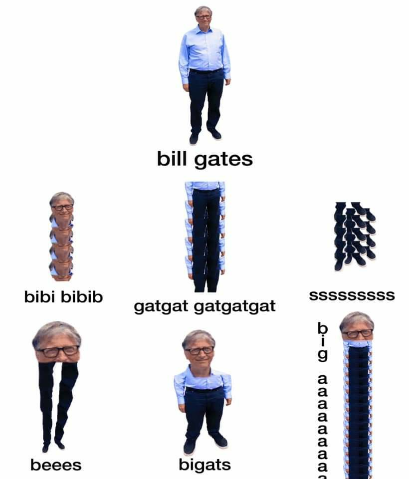
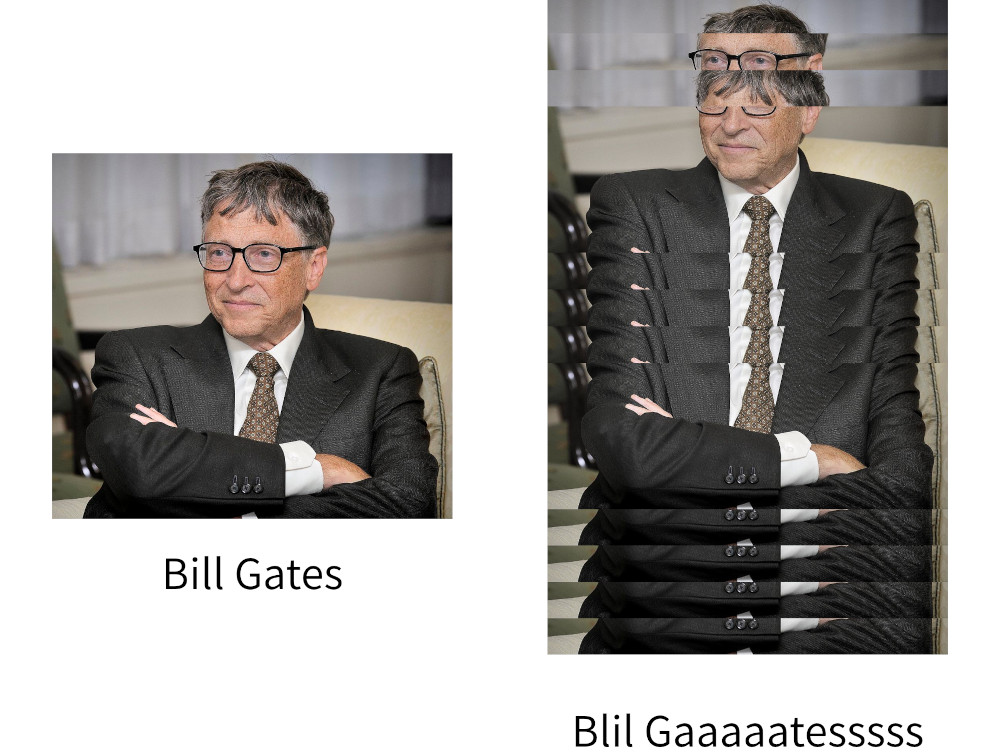

# bill-bill-bill

A tool to generate images for repeating text memes. Specifically, this meme was the inspiration behind this project:



Using `bill-bill-bill`, you too can create your own meme like this!



The image on the right was produced using `./bill-bill-bill bill.jpg "bill gates" "blil gaaaaatesssss" -o bill-pb-morphed.jpg`


## Usage

```
Usage:
  bill-bill-bill [OPTION...] <in_file> <base_string> <meme_string>

  -d, --display          Display the image, even when an output is specified.
  -o, --output filename  The output filename for the image. Enabling disables
                         display if --display is not specified.
  -h,                    Display help message
```

The image is generated based on substrings in the `meme_string` found in the `base_string`.

## Dependencies

- `cmake`
- `cxxopts`
- `CImg`
- `libX11`
- `gtest` (optional)

## Building

To build, run

```
$ mkdir build && cd build
$ cmake ..
$ make bill-bill-bill
```

To build the tests, you can also run `make tests`
